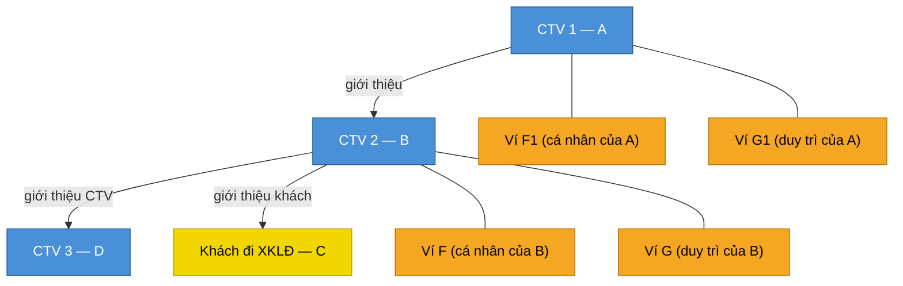
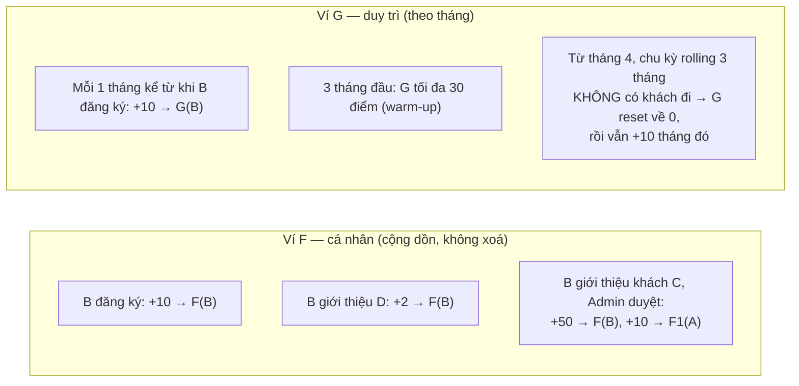
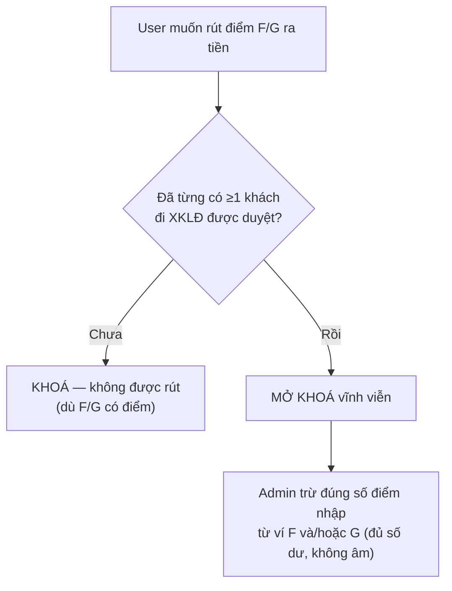

# Sơ đồ tính điểm (từ `xkld.png`)

Diễn giải trực quan bản vẽ gốc **"CÁCH TÍNH ĐIỂM"**. Đây là bản Mermaid hoá của `docs/xkld.png`;
luật chi tiết nằm ở [`PRD.md`](./PRD.md), thiết kế kỹ thuật ở [`tech-spec.md`](./tech-spec.md).

## 1. Mạng lưới giới thiệu & 2 ví điểm

Bản vẽ mô tả chuỗi giới thiệu `A → B`, và mỗi CTV có 2 ví: **F (cá nhân)** và **G (duy trì)**.
Node `E` (ví điểm của B) chỉ là cách bản vẽ tách ví F và G của B ra cho dễ nhìn.

## 2. Luật cộng điểm (đúng các gạch đầu dòng trong ảnh)

## 3. Điều kiện rút tiền (redemption)

## 4. Đối chiếu nguyên văn ảnh → luật

| Câu trong ảnh | Luật hệ thống |
|---|---|
| "Khi B đăng ký thì B được nhận 10 điểm vào ví F" | `REGISTRATION_BONUS` +10 F |
| "B giới thiệu ra D thì B nhận được 2 điểm vào ví F" | `REFERRAL_SIGNUP_BONUS` +2 F |
| "B giới thiệu khách C, B dc 50 điểm vào ví F, A được 10 điểm vào ví F1" | `CUSTOMER_REWARD` +50 F (B) + `CUSTOMER_REFERRAL_BONUS` +10 F (A) — cần Admin duyệt |
| "Từ khi B đăng ký thì cứ sau 1 tháng lại cộng vào ví G 10 điểm" | `MAINTENANCE_ACCRUAL` +10 G / tháng |
| "Trong 3 tháng ví G sẽ có 30 điểm, nếu tháng thứ 4 không có khách C đi thì ví G bị xoá về 0 … theo chu kỳ 3 tháng k giới thiệu sẽ bị cho về 0" | `MAINTENANCE_RESET` (rolling 3 tháng, từ tháng 4) |
| "Điều kiện để được đổi điểm ra tiền … khi B giới thiệu được C thì mới được rút điểm từ ví F và G" | Mở khoá redemption: cần ≥1 order APPROVED |
| "Ví F sẽ luôn được cộng dồn và k bị xoá về 0" | F cộng dồn, chỉ giảm khi `REDEMPTION` |

> **Ghi chú diễn giải:** ảnh gốc nói "qua 3 tháng G có 30; không có khách thì xoá về 0". PRD áp dụng
> **cửa sổ rolling 3 tháng** (đánh giá mỗi tháng từ tháng 4) + warm-up 3 tháng, để không reset ngay
> từ tháng đầu. Xem PRD §6.4.
</content>
</invoke>
